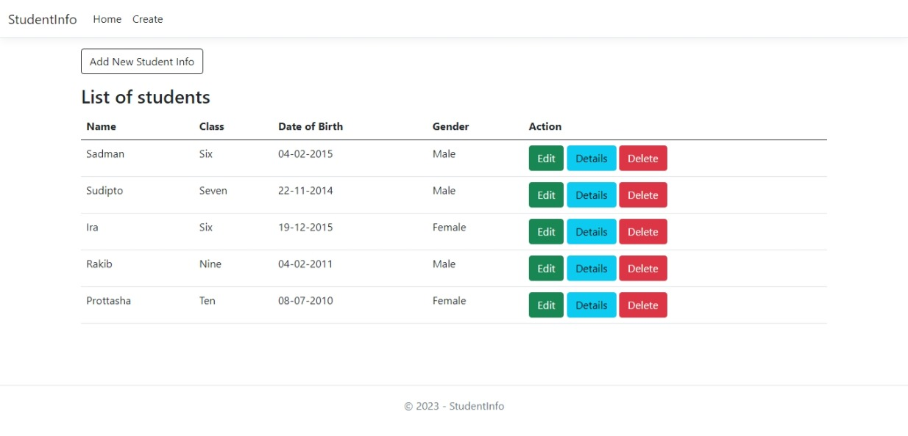
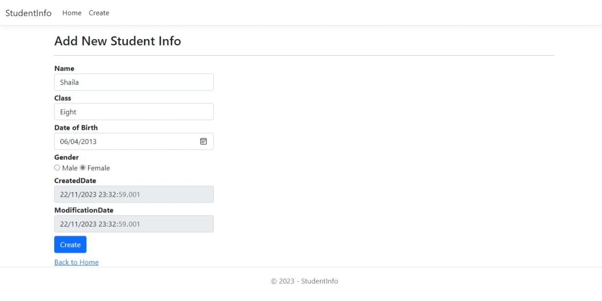
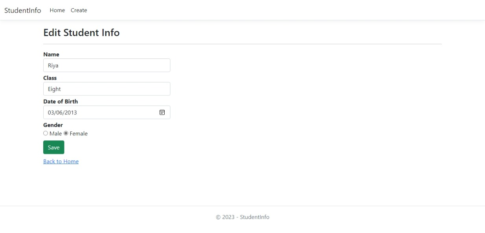
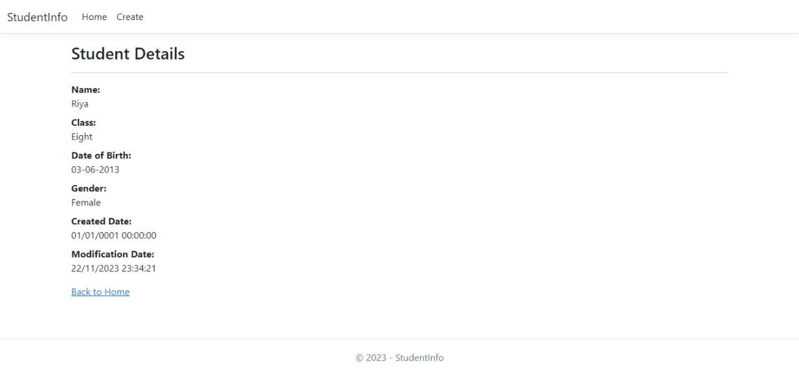
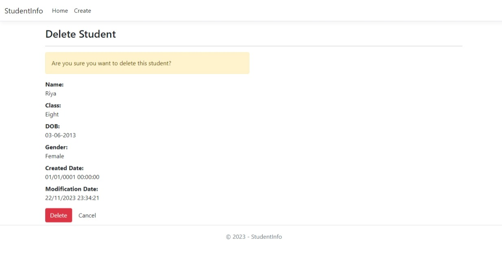

 

<h2 align="center">Student-Info</h2>

A web application using ASP.NET Core MVC and Entity Framework Core to manage student records.
 
 

<h2>📝 About The Project </h2>

Student-Info allows educational institutions to efficiently manage student records. It provides essential functionalities for adding editing viewing and deleting student information as well as listing all students in a user-friendly interface.

  <h4>Home Page</h4>
  
  <h4>Create Student Page</h4>
  
  <h4>Edit Student Page</h4>
  
  <h4>Student Details Page</h4>
  
  <h4>Delete Student Page</h4>
  

  
<h2>🧐 Features</h2>

Here're some key features:

1.   <b>Add New Student Info:</b> Easily add new student details including name class date of birth and gender.  
2.   <b>Edit Student Information:</b> Update existing student records with ease keeping the data up-to-date.  
3.   <b>View Student Details:</b> Access comprehensive student profiles including class date of birth and creation/modification dates.  
4.   <b>Delete Students:</b> Remove student records from the database when necessary.  
5.   <b>Class Management:</b> Includes a Class table for managing class information.  

  
  
<h2>💻 Built with</h2>

Technologies used in the project:

*   ASP.NET Core MVC
*   Entity Framework Core
*   C#
*   HTML/CSS
*   SQL Server
